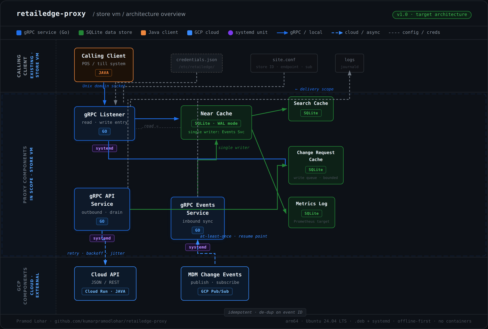

# RetailEdge Proxy

An offline-first store master data proxy in Go.

Runs on a Linux VM inside each retail store. Keeps a local SQLite
Near Cache of product master data. The store serves product reads
locally — the WAN link to GCP is never in the read path.

**When the WAN drops:** reads continue. Writes queue locally.  
**When the WAN returns:** the queue drains. Sync resumes from checkpoint.  
**The Java POS client:** notices nothing either way.



---

## Services

| Service        | Description                           | Packaged as           |
| -------------- | ------------------------------------- | --------------------- |
| gRPC Listener  | Serves product reads over Unix socket | `retailedge-listener` |
| Events Service | Consumes Pub/Sub, writes Near Cache   | `retailedge-events`   |
| API Service    | Drains write queue to Cloud API       | `retailedge-api`      |

All three are Debian packages managed by systemd.
No containers. No Kubernetes.

---

## Stack

Go · gRPC · SQLite (WAL mode) · Protocol Buffers
GCP Pub/Sub · Cloud Run · Debian packaging · systemd
Ubuntu 24.04 · arm64

---

## Architecture

See [ARCHITECTURE.md](ARCHITECTURE.md) for full design decisions,
failure scenarios, and repository layout.

---

## Chaos Demo

```bash
# Seed products via Pub/Sub (on Mac)
bash scripts/seed-products.sh

# Run the offline demo (in VM)
bash scripts/chaos.sh
```

The demo cuts cloud connectivity via iptables, proves reads continue
serving from the local cache, then restores connectivity and shows
the write queue drain automatically.

---

## Build

```bash
# Inside the store VM
go build ./...

# Run migrations
go run ./cmd/migrate/

# Start gRPC Listener
go run ./cmd/listener/

# Check health
go run ./cmd/metrics/
```

---

_Pramod Lohar · [Architecture](ARCHITECTURE.md) ·
[github.com/kumarpramodlohar/retailedge-proxy](https://github.com/kumarpramodlohar/retailedge-proxy)_
